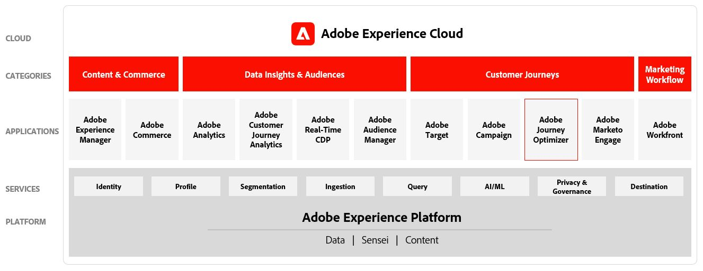

# Overview

## Learning objectives

* Learn how to use segments for marketing
* Learn about setting up offers
* Learn how to design email & push messages
* Learn how to create a custom journey

## Adobe Journey Optimizer

For customer centric brands, Adobe Journey Optimizer is an agile and scalable application built natively on the Adobe Experience Platform for orchestrating and delivering personalised, connected customer journeys across any app, device, screen, or channel.​

Journey Optimizer allows organisations to create, orchestrate and deliver both scheduled marketing programs and outreach (such as weekly promotions for a retail store) and tailored individual communications (like a push notification for an item that a loyalty app customer may have looked at that was previously out of stock) within the same application.&#x20;

Adobe Journey Optimizer provides brands the flexibility to engage with customers across a broad range of use cases:

* With 1:1, real-time messages that are initiated based on the customer’s behaviour, engagement, and interactions. For example, a customer enters a store location and receives a push message for a current in-store offer on a recently restocked product based on the customer’s past purchase.
* Optimise journeys and deliver triggered messages based on business-related events. For example,  any offer or message contextually relevant to the customer’s journey, such as a weather-related travel impact or delayed shipping notification.
* Orchestrate, optimise, and deliver audience-based email and mobile push campaigns. For example, email newsletters or daily offers update via mobile app push message.
* Orchestrate and optimise audience-based programs or 1:1 journeys for delivery through external mar-tech and customer experience applications. For example, to deliver notifications, messages and offers through channels like SMS, direct mail, or kiosks.
* Support for broad-based, high throughput burst messaging. For example, breaking news alerts or live event updates. &#x20;

