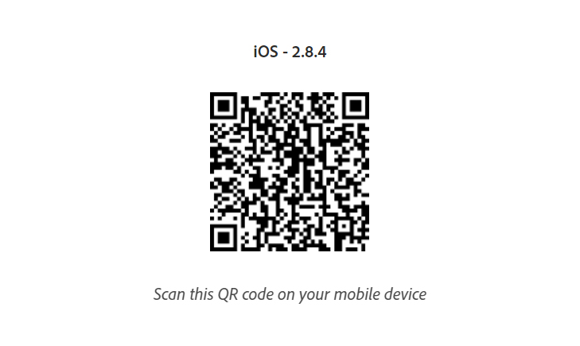
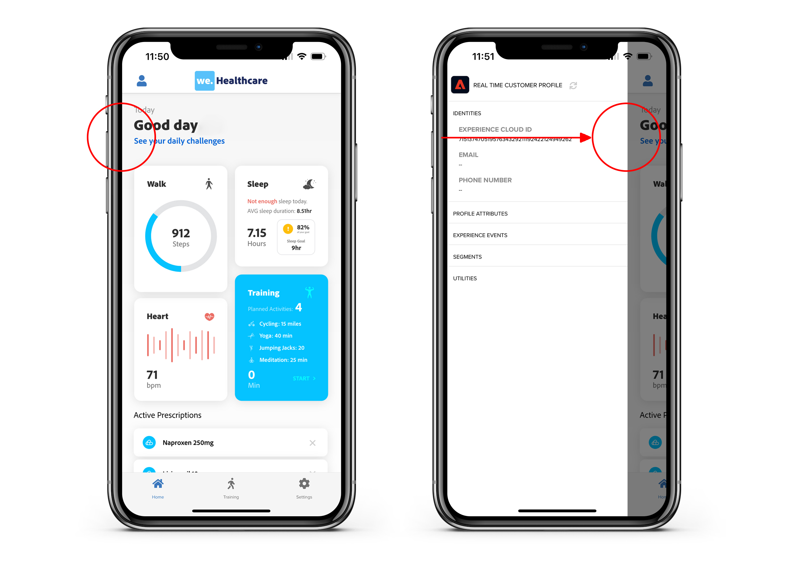

# Mobile App

### App installation

Download the Mobile app using the QR code on your phone.

<figure><figcaption></figcaption></figure>

### First launch

When you launch the app for the first time, you'll be prompted to log in with your Adobe ID. Use the same Adobe ID you used to log into the Adobe Experience Platform.

The app can prompt you several request, for example to `allow push notifications` and `allow the use of gps`. Make sure to allow these requests.

### Configuring the app

To load the WKND Fly content, you'll need to import a custom project

1. Navigate to Settings in the bottom menu
2. Check **Custom Project** and insert the **Project ID** `sacker-1HHJ`
3. Click **Save**.
4. Your app should now reload and show the WKND Fly demo app.

### Showing the Real-time Customer Profile on the app

In the mobile app you can look at the Real-time Customer Profile, just like you've seen on the WKND Fly website. To show the panel, drag your finger from the left side to the right side of the screen.

<figure><figcaption></figcaption></figure>

### Linking your profile to the mobile app

In order to receive push notifications from the journeys you create, you'll have to link your mobile app profile to your web profile. This will stitch the identifiers of both profiles and merge all data into a single profile. You will be prompted to log in when you open the mobile app.&#x20;

You can now log in with your email address. You can leave the password blank, it's not used in the demo.

After your login, you'll notice the Real-Time Customer Profile will have stitched your profiles and a lot more data is now available. If you don't see the data in the panel immediately, refresh the panel by clicking  or closing the app completely and restarting.

